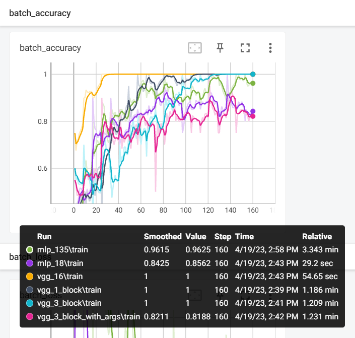
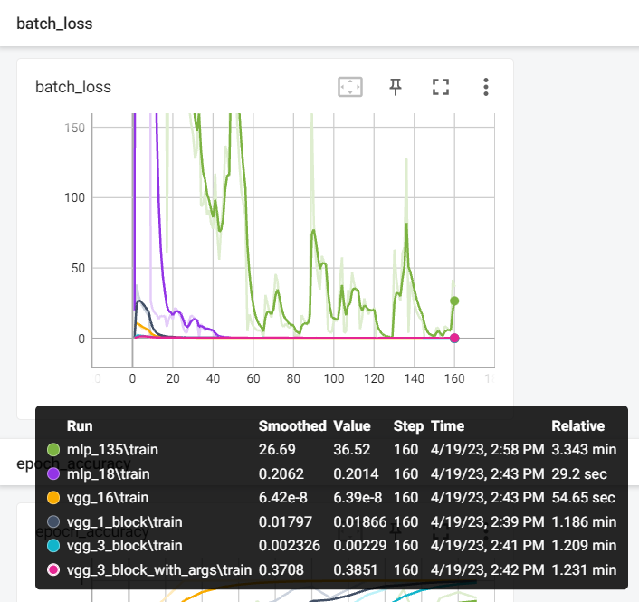
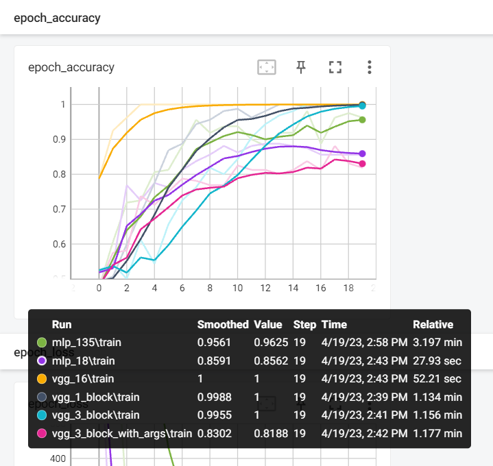
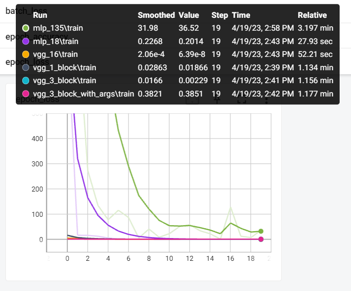
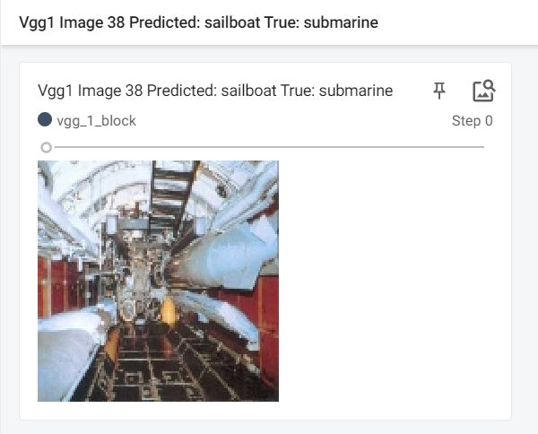

### Are the results as expected? Why or why not?

`VGG (1 Block)`

In VGG (1 block) architecture, max-pooling and fully connected layers are placed after the single block of convolutional layers . Although this architecture has a limited number of parameters and trains quite quickly, it might not be able to recognise complicated aspects in the input.

`VGG (3 blocks)` 

This architecture made up of three blocks of convolutional layers, and each block is followed by fully connected and max-pooling layers. This architecture can capture more complicated aspects in the data because it has more parameters than VGG (1 block). However, because there are more parameters, it takes longer to train than VGG (1 block).

`VGG (3 blocks with data argumentation)` 

By adding different changes to the input images, such as rotation, scaling, and cropping, we inflate the size of the training set. By exposing the model to a larger range of input images when it is used with VGG (3 blocks), data augmentation can increase the model's capacity to generalise to new data.

`VGG 16 Tranfer Learning`

When training a new model on a different dataset, transfer learning entails using a previously trained model as a starting point. Two pre-trained models that can be utilised for transfer learning are VGG16 and VGG19. These models have already learned to recognise a range of visual traits after being trained on massive datasets like ImageNet. For us, we used VGG16. We can reduce the amount of time and computational resources required to train a new model on a smaller dataset by starting with these pre-trained models. 

Furthermore, when the target dataset is modest, transfer learning using VGG16 outperforms training a model from scratch in terms of performance. 

`MLP with 135 million parameters`

The choice between using a MLP with 135 million parameters versus transfer learning with VGG16 depends on several factors, including the specific task, available resources, and the size of the dataset.

In general, using an MLP with 135 million parameters can potentially achieve higher accuracy compared to transfer learning with VGG16, especially for more complex tasks. However, training such a large MLP from scratch requires a significant amount of computational resources and time, making it impractical for many applications. Additionally, having such a large number of parameters increases the risk of overfitting, which can negatively impact model performance.

On the other hand, transfer learning with VGG16 can be a good choice for image classification tasks, especially if the dataset is small.

`MLP with 18 million parameters`

In general, an MLP with 135 million parameters is likely to have a higher capacity to model complex relationships within the data compared to an MLP with 18 million parameters. However, having a larger number of parameters does not necessarily guarantee better performance, and can increase the risk of overfitting, especially if the dataset is small.

On the other hand, an MLP with 18 million parameters is likely to require fewer computational resources and training time compared to an MLP with 135 million parameters. This can be beneficial, especially if the available resources are limited.

The number of layers in both MLPs being 3, it's important to note that the depth of the neural network is also an important factor to consider. Increasing the depth of the network can help to model more complex relationships within the data. However, it can also increase the risk of vanishing or exploding gradients, making it more difficult to train the network.

| Model Name                     | Training Time | Train Loss  | Train Acc   | Test Acc    | Num Params |
|:------------------------------:|:-------------:|:-----------:|:-----------:|:-----------:|:----------:|
| VGG 1 Block                    | 72.28820062   | 0.020565649 | 1           | 0.824999988 | 33556481   |
| VGG 3 Block                    | 73.74451399   | 0.001194572 | 1           | 0.824999988 | 8759681    |
| VGG 3 Block with Argumentation | 75.15016341   | 0.355915844 | 0.84375     | 0.75        | 8759681    |
| VGG 16                         | 55.6619885    | 6.14E-08    | 1           | 0.850000024 | 15763521   |
| MLP18                          | 29.99000883   | 0.192937687 | 0.856249988 | 0.675000012 | 17832193   |

### Does data augmentation help? Why or why not?

Data augmentation is a method of creating additional training data from the existing datase by using various transformations including rotation, scaling, flipping, cropping, and other picture modificationst. 

By doing this, the model is exposed to a wider variety of training data and can improve its ability to identify and generalise to fresh, unexplored data.

Data augmentation can reduce overfitting, which occurs when the model memorises the training data rather than generalising to new data, by expanding the quantity and diversity of the training dataset. This may enable the model to perform more effectively on the test data.

In other words, data augmentation makes the model more reliable and capable of identifying objects or patterns.

For us, the argumented model is working worse than the original one. One reason could be, less number of epochs to train with, perhaps may with with higher epoch, we will get better results.

### Does it matter how many epochs you fine tune the model? Why or why not?

The term "number of epochs" refers to how many times the complete  dataset was run through the model during training while fine-tuning a pre-trained model. 

If the number of epoch is low, the model will underfit.

On the other side, if the number of epochs is too high , then model might begin to overfit to the training data, which would mean that it would memorise the training data rather than generalising to new data. 

It is crucial to select the right number of epochs for fine-tuning in accordance with the difficulty of the task, the size of the dataset, and the unique properties of the model and data. Normally, this value is calculated by keeping track of the model's performance on a validation set during training and halting when the validation accuracy stops increasing or begins to drop.

Even though we have not implemented it, but early stopping could be a good measure to utilize, when it comes to number of epochs.

Early stopping is a callback technique that can help prevent overfitting and save computational resources by stopping the training process before it completes all epochs. It can improve model performance, reduce training time, and help generalize the model better to unseen data.

### Are there any particular images that the model is confused about? Why or why not?

This was the image for which each model got confused.
